# jarvis — AWS上に構築する音声AIアシスタント

Amazon Nova 2 Sonic を使った音声対話アシスタントを、Terraform で AWS 上に構築するプロジェクト。
個人開発だが、**「作って壊す」を前提としたインフラ設計とコスト最適化の判断**を主題に置いている。

Sprint 0（インフラ基盤）、Sprint 1（ブラウザからの音声対話）、Sprint 2（外部ツール連携）が完了。
ブラウザのマイクで話しかけると音声で返答が返り、現在の日時と天気にも答えられる。

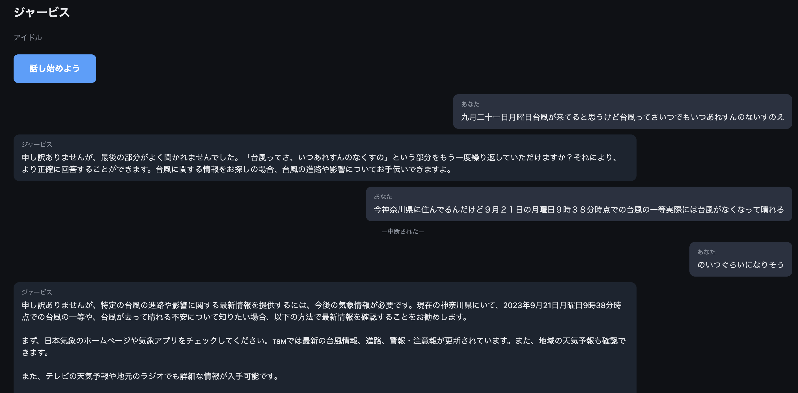

*割り込み（`—中断された—`）を挟んでも文脈が保たれている（Sprint 1 時点）。日付や天気は Sprint 2 のツール連携で答えられるようになった。*

---

## 構成

| 役割 | 使用サービス |
|---|---|
| 音声対話 | Amazon Bedrock / Nova 2 Sonic |
| 実行基盤 | ECS Fargate（0.5 vCPU / 1 GiB、Spot） |
| 接続 | ALB（WebSocket、スティッキーセッション有効） |
| 記憶 | DynamoDB（オンデマンド、TTL 付き） |
| イメージ | ECR |
| 外部 API | Open-Meteo（天気、APIキー不要） |
| アプリ | FastAPI + AudioWorklet（素の JavaScript） |
| IaC | Terraform 1.14 / AWS Provider 6.x |
| リージョン | ap-northeast-1 |

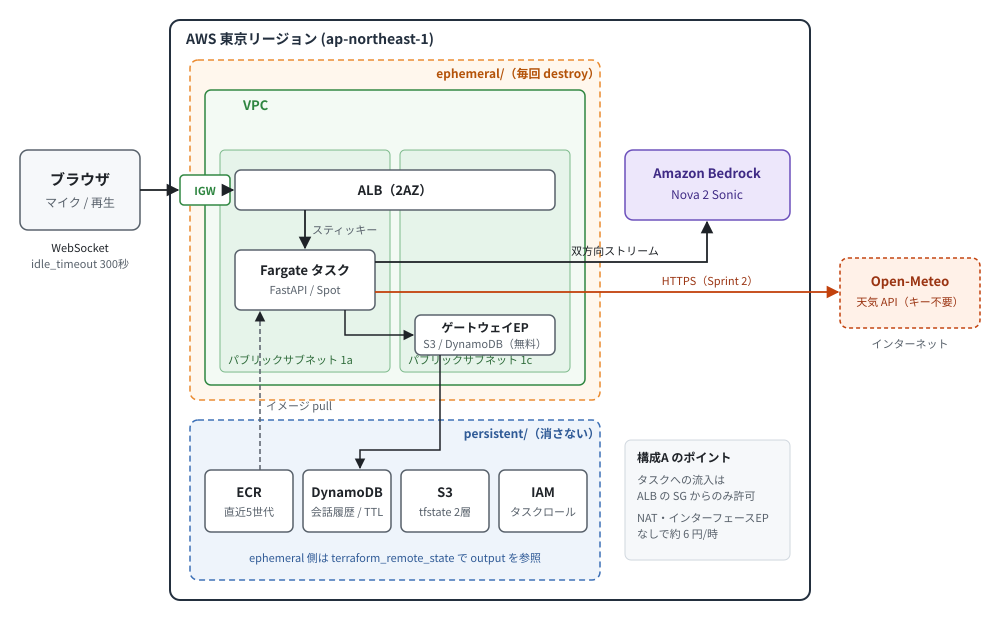

*Terraform の state を `persistent/`（消さない）と `ephemeral/`（毎回 destroy）に分けている。Open-Meteo への通信は Sprint 2 で追加。*

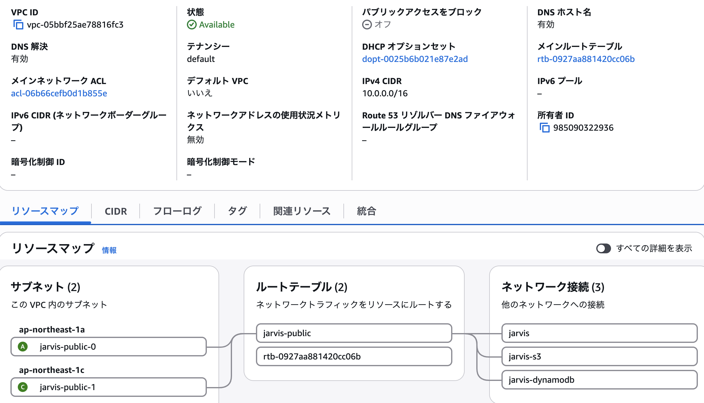

*構成A。ALB の要件を満たすためパブリックサブネットを 2AZ に配置し、Fargate タスクとゲートウェイエンドポイント（S3 / DynamoDB）を同一 VPC 内に置いている。*

### Nova 2 Sonic

音声を直接受け取り音声を返す speech-to-speech モデル。
STT → LLM → TTS と繋ぐ従来構成に比べて応答遅延が小さい。
クロスリージョン推論には非対応のため、東京リージョンへ直接リクエストを投げる必要がある。

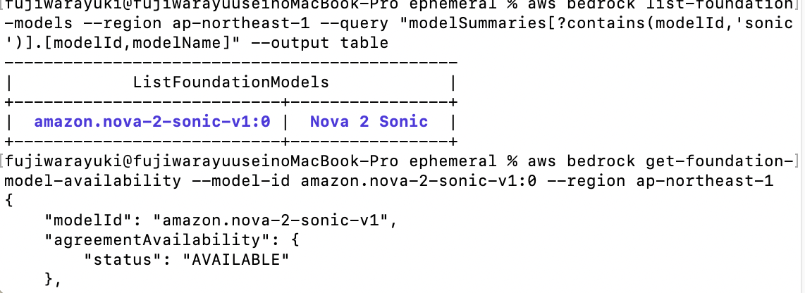

*モデル ID は `amazon.nova-2-sonic-v1:0`。東京リージョンで `AUTHORIZED` / `AVAILABLE` を確認済み。*

---

## Sprint 1：ブラウザからの音声対話

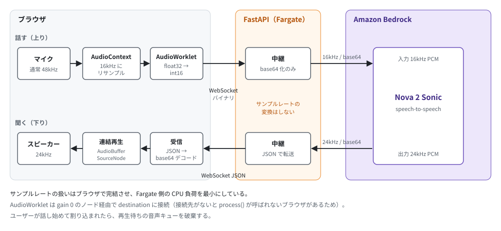

*変換はすべてブラウザ側で完結し、サーバーは中継に徹している。*

**サーバーは変換をしない。** サンプルレートの取り扱いはブラウザ側に寄せ、
FastAPI は受け取った PCM をそのまま Bedrock へ、返ってきた音声をそのままブラウザへ流すだけにしている。
Fargate 側の CPU 負荷を最小に保つための判断。

### 設計上の判断

**リサンプルを自前で書かない。**
ブラウザのマイクは通常 48kHz で取得されるが、Nova 2 Sonic の入力は 16kHz。
`new AudioContext({ sampleRate: 16000 })` を指定すればブラウザ側が変換してくれるため、
間引き処理を自分で実装する必要がない。

**ローカル開発で HTTPS を回避した。**
ブラウザでマイクを使う `getUserMedia` はセキュアコンテキストを要求するが、
`localhost` は例外として扱われる。TLS 対応は Sprint 2 以降に回し、
Sprint 1 の実装中は AWS 側のリソースを一切立てずに進めた。
この間の課金は Bedrock の会話分のみ（会話1分あたり約 2.3 円）。

**AudioWorklet の出力を無音のゲインに接続している。**
接続先がないと `process()` が呼ばれないブラウザがあるため、
gain 0 のノード経由で destination に繋いでいる。

---

## Sprint 2：外部ツール連携

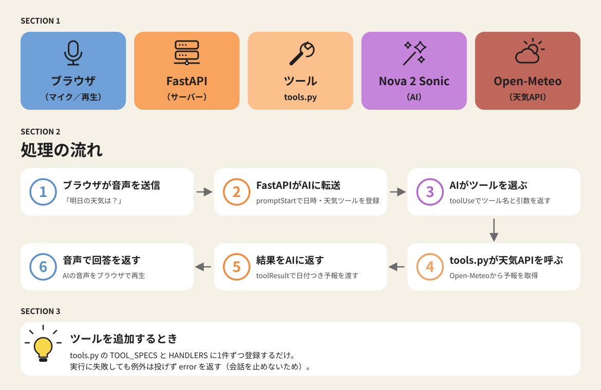

*モデルがツールを選び、FastAPI がサーバー側で実行して結果を返す。モデルは結果を踏まえて音声で答える。*

Nova 2 Sonic のツール呼び出し（tool use）を使い、次の2つを答えられるようにした。

| ツール | 内容 | 外部通信 |
|---|---|---|
| `getDateTime` | 日本時間の日付・曜日・時刻 | なし |
| `getWeather` | 指定都市の現在の天気と3日間の予報 | Open-Meteo |

モデルは学習時点の日付を「今日」だと思い込むため、Sprint 1 では「今年は2023年です」のような誤答が出ていた。
日時・天気の質問には必ずツールを使うよう、システムプロンプトで明示している。

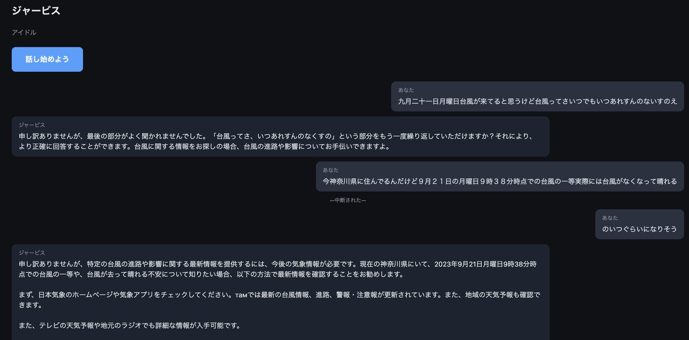

*Sprint 1 時点。「2023年9月21日」と誤った日付を名乗り、台風について聞いても外部サイトを勧めるしかなかった。*

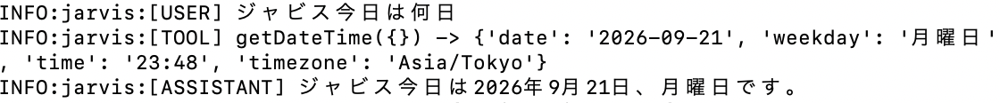

*導入後。「今日は何日」に対して `getDateTime` が呼ばれ、正しい日付と曜日で答えている。*

### 設計上の判断

**ツールの追加は `tools.py` だけで完結させる。**
`TOOL_SPECS` に仕様を、`HANDLERS` に実行関数を1件ずつ登録すれば増やせる。
`main.py` はツールの中身を知らず、受け取って実行して返すだけにしている。

**ツールが失敗しても会話を止めない。**
例外は投げず `{"error": ...}` を返す。モデルはエラー内容を踏まえて「取得できませんでした」と答えられる。
ツール名はモデルが大文字小文字を揺らすことがあるため、小文字で照合している。

**HTTP を叩くツールは別スレッドで実行する。**
`asyncio.to_thread` で逃がし、天気の取得中も音声のやり取りを止めない。

**読み上げ前提でデータを整える。**
天気コードは数字のまま渡すと誤訳しやすいので日本語に変換し、気温は整数に丸めている
（小数を渡すと「28.7度」と読み上げる）。放っておくと3日分を箇条書きで読み上げるため、
「要点を1〜2文で、今日と明日の傾向だけ」と指示している。

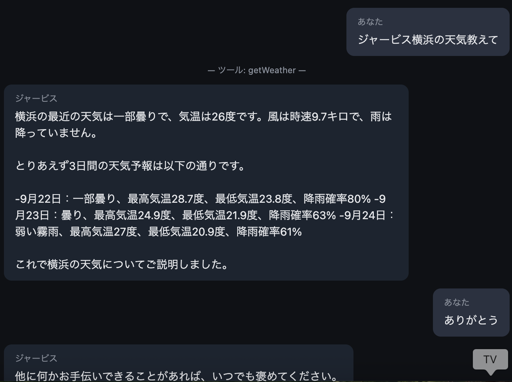

*調整前。3日分を箇条書きで並べ、「28.7度」「時速9.7キロ」と小数点まで読み上げていた。*

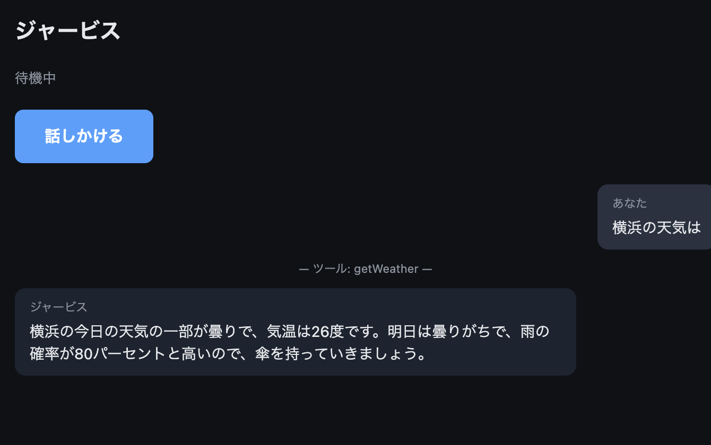

*調整後。1〜2文にまとまり、雨の確率が高いので傘を勧めている。なおこの時点では、今日（9月22日）の降水確率 80% を「明日」と取り違えていた。予報に「今日」「明日」のラベルを付けて解消した（「詰まった点」を参照）。*

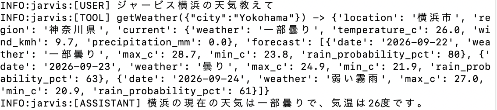

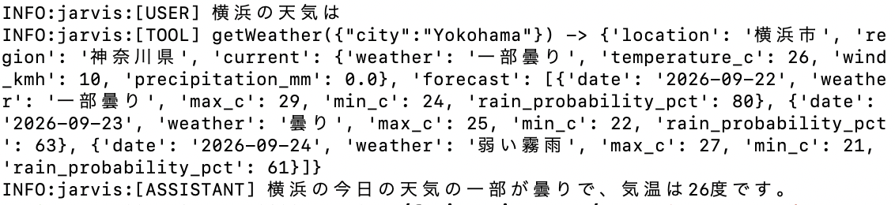

*上が調整前、下が調整後のログ。モデルに渡す前の時点で、気温や風速を整数に丸めている。*

**地名検索の結果をキャッシュする。**
天気の取得は地名検索と予報取得の2回通信が必要で、それぞれ TLS の確立に数秒かかる。
地名から緯度経度への変換は結果が変わらないので `lru_cache` で覚え、2回目以降の待ち時間を半分にした。
都市名は検索が安定するローマ字表記で渡すよう、ツール定義に書いている。

---

## 設計判断（インフラ）

### 1. state を2層に分離した

Terraform を `persistent/` と `ephemeral/` に分け、state ファイルも別管理にしている。

```
jarvis/
├── persistent/   # 消さない：S3(tfstate), DynamoDB, ECR, IAM
├── ephemeral/    # 毎回消す：VPC, ALB, ECS
└── app/          # FastAPI, AudioWorklet, Dockerfile
```

分離しないと、`destroy` のたびに会話履歴とコンテナイメージが消えて、毎回ゼロから作り直すことになる。
ephemeral 側は `terraform_remote_state` で persistent の output を参照し、ARN をハードコードしない。

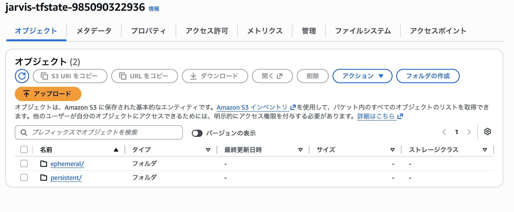

*同一バケット内で `persistent/` と `ephemeral/` にキーを分けている。ephemeral を destroy しても persistent の state は残る。*

ECR を persistent 側に置いたのは、イメージのビルドと push をやり直すと
apply の所要時間が跳ね上がるため。

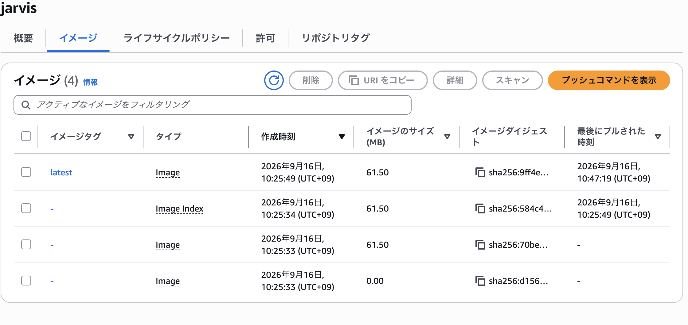

*イメージサイズ 61.5 MB。ライフサイクルポリシーで直近5世代のみ保持。タグなしのマニフェストも残る点に注意。*

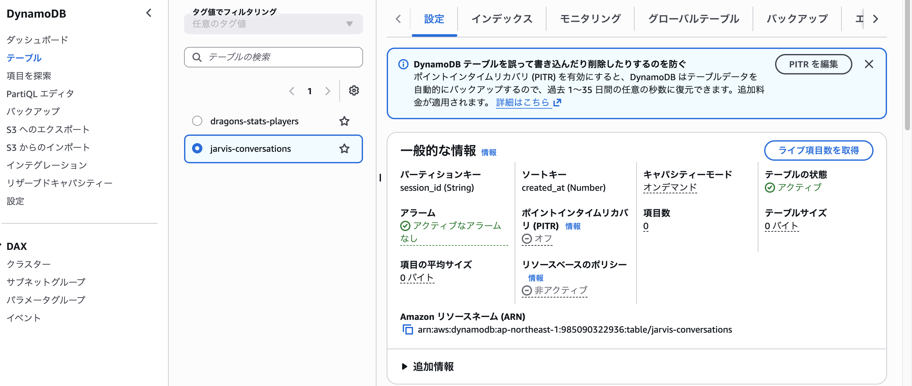

*パーティションキー `session_id`、ソートキー `created_at`、オンデマンド課金。`expires_at` で TTL を設定済み。*

### 2. 実行基盤に AgentCore Runtime ではなく Fargate を選んだ

音声は長時間の双方向ストリーミングなので、Lambda では成立しない。
AgentCore Runtime のほうが構築は速いが、以下の理由で Fargate を選択した。

- WebSocket の保持、スケーリング、監視を自分で設計する必要があり、学習効果が高い
- ネットワーク構成を含めて IaC で完結できる
- SAP（Solutions Architect Professional）の出題領域と重なる

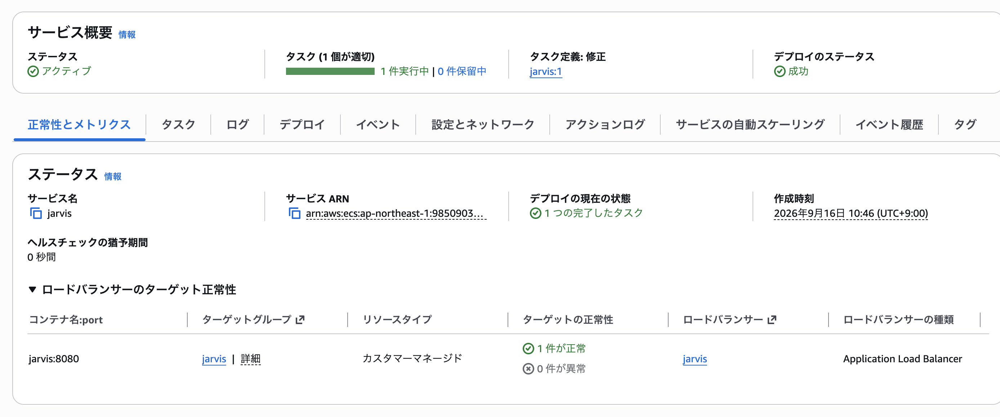

*タスク1件が実行中、デプロイステータス成功、ターゲット正常性1件。*

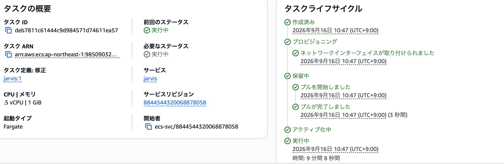

*0.5 vCPU / 1 GiB、起動タイプ Fargate。プロビジョニングからイメージ pull、実行までのライフサイクル。*

### 3. VPC エンドポイントをやめてパブリックサブネットにした

当初はプライベートサブネット＋VPC エンドポイントで設計したが、**コストを計算して方針を変えた**。

プライベートサブネットで Fargate を動かすには、Bedrock だけでなく
ECR（api / dkr）と CloudWatch Logs のエンドポイントも必要になる。

| 構成 | 内訳 | 時間単価 |
|---|---|---|
| A. パブリックサブネット + パブリックIP | ALB + Fargate + EIP | **約 6 円** |
| B. プライベート + インターフェース型 4本 | A + エンドポイント（1AZ） | 約 15 円 |
| C. プライベート + NAT ゲートウェイ | A + NAT | 約 16 円 |

インターフェース型は 1AZ あたり 1本 月7.3ドル前後。4本を 2AZ に置くと月58ドルとなり、
NAT ゲートウェイ（月33ドル前後）より高くなる。**「エンドポイントのほうが安い」はこの規模では成立しない。**

一方、ゲートウェイ型（S3 / DynamoDB）は無料なので、構成 A でも残している。

構成 A ではセキュリティグループでインバウンドを ALB からのみに制限し、
パブリックサブネットに置くことによるリスクを抑えている。

なお構成 A は、Sprint 2 で Google カレンダーや Notion の API を叩く際の
外部通信経路の問題も同時に解決する（VPC エンドポイントは AWS サービスにしか効かない）。

### 4. ALB の idle_timeout を 300 秒に延長した

既定の 60 秒だと、会話の無音が1分続いた時点で WebSocket が切断される。
音声アプリでは致命的なので、あらかじめ延長している。

### 5. スティッキーセッションを有効にした

Nova Sonic のセッションはタスクのメモリ上にあるため、
再接続時に別タスクへ振られると会話が失われる。
Sprint 3 で状態を DynamoDB へ外出しするまでの暫定措置。

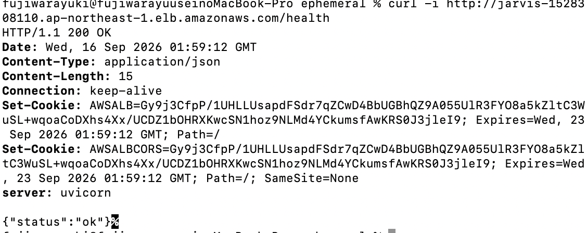

*`AWSALB` Cookie が返っており、スティッキーセッションが実際に機能していることが確認できる。*

### 6. 3構成を変数で切り替えられるようにした

`use_vpc_endpoints` と `use_nat` の bool 変数だけで A / B / C を切り替えられる。
ブランチを分けずに済むので、コスト比較を `terraform apply` 一発で再現できる。

```bash
terraform apply                                # 構成A（常用）
terraform apply -var="use_vpc_endpoints=true"  # 構成B
terraform apply -var="use_nat=true"            # 構成C
```

---

## 実測値

| 項目 | 値 |
|---|---|
| ephemeral リソース数 | 19 |
| apply 所要時間 | **3分6秒**（うち ALB 作成が 2分16秒） |
| persistent リソース数 | 11 |
| コンテナイメージサイズ | 61.5 MB |
| 稼働コスト（構成A） | 約 6 円/時 |
| Nova 2 Sonic | 会話 1分あたり約 2.3 円 |
| **Sprint 0 + 1 の AWS 実費合計** | **約 50 円**（$0.32） |

Sprint 0 と Sprint 1 を通して実際に請求された額は $0.32。
インフラを 19 リソース分構築して破棄し、音声対話を実装して動作確認するまでを含めての金額になる。
ALB の稼働時間が短く、Bedrock も実際に発話している時間しか課金されないため、
事前の見積もり（100〜150 円）を下回った。

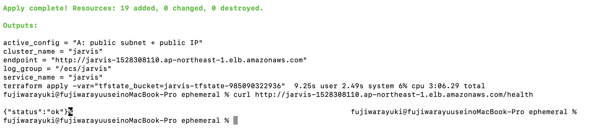

*19リソースを3分6秒で構築。`active_config` の output で、どの構成で立っているかを判別できるようにしている。*

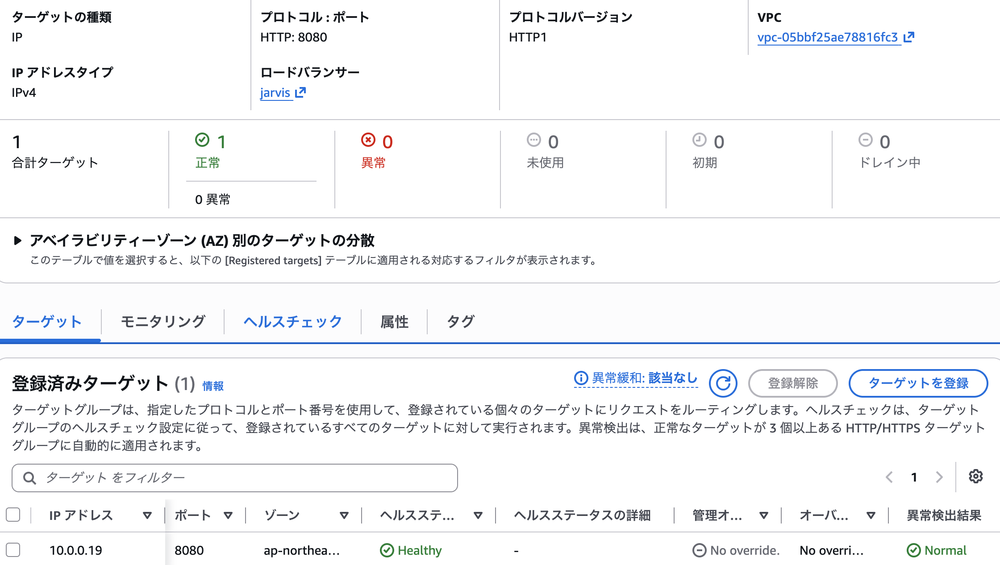

*ALB のヘルスチェック通過。ECS で最も詰まりやすい部分で、タスクのバインドアドレスを `0.0.0.0` にすることが条件。*

apply 完了から `/health` が通るまで、ヘルスチェック通過を含めて約1分。

---

## 運用

コストの大半は ALB とエンドポイントの**時間課金**なので、
タスクを止める（`desired_count = 0`）だけでは不十分。
使わないときは ephemeral ごと destroy する。

```bash
# 作業開始
cd ephemeral && terraform apply

# 作業終了
terraform destroy
```

persistent 層は残るため、会話履歴もコンテナイメージも保持される。
月あたりの保持コストは数円。

### ローカルでの開発

Sprint 1 の実装中は AWS 側のリソースを立てず、Docker で動かした。

```bash
cd app
docker run --rm -it -p 8080:8080 \
  -v ~/.aws:/root/.aws:ro -v "$PWD":/app \
  -e AWS_PROFILE=<profile> -e AWS_REGION=ap-northeast-1 \
  -e VOICE_ID=tiffany \
  jarvis:latest uvicorn main:app --host 0.0.0.0 --port 8080 --reload
```

`http://localhost:8080` を開く。localhost はセキュアコンテキスト扱いのため、
HTTPS なしでマイクが使える。

---

## 詰まった点

### ツールの実行タイミングは contentEnd(TOOL)

`toolUse` イベントの時点ではまだ実行しない。続く `contentEnd`（type が `TOOL`）が
「モデルが結果を待っている」合図で、ここで実行して結果を返す。

### toolUseId が一致しないとエラーにならずに呼び直され続ける

結果は `contentStart` → `toolResult` → `contentEnd` の3点セットで返す。
このとき `toolUseId` が受け取った値と一致しないと、エラーは出ずに同じツールが何度も呼ばれ直す。
受け取った値をそのまま返す必要がある。

### Open-Meteo の TLS ハンドシェイクに数秒かかる

環境によって約6秒かかることがあり、既定のタイムアウトでは足りなかった。
タイムアウトを15秒に延ばし、上記のキャッシュで通信回数自体も減らした。

### 天気予報の「今日」と「明日」を取り違える

予報を日付（`2026-09-22` など）だけで返していたところ、今日の降水確率を「明日は80%」と答えた。
モデルは天気の質問では `getDateTime` を呼ばず今日の日付を知らないため、1日目の予報を「明日」と読んでいた。
各日に `"label": "今日"` / `"明日"` / `"明後日"` を付けて返すようにし、日付の解釈をモデルに任せないようにした。

### Nova 2 Sonic はテキストのみのセッションを受け付けない

コスト削減のためテキストだけで疎通確認をしようとしたところ、
`Prompt must have at least one audio content` で弾かれた。

プロンプトには最低1つの AUDIO コンテンツが必要で、
システムプロンプトを TEXT で渡すことはできても、
ユーザー入力を TEXT だけで完結させることはできない。

### 双方向ストリーミングには AWS CRT が必須

標準の HTTP トランスポートは HTTP/2 の双方向イベントストリームに対応していない。
`aws-sdk-bedrock-runtime[awscrt]` を入れ、`AWSCRTHTTPClient()` を明示的に渡す必要がある。
またこの SDK は Python 3.12 以上を要求する（macOS 標準の 3.9 では動かない）。

### 認証情報が誤っていても例外が飛ばない

イベントが1件も返らないまま無限に待ち続ける。
「エラーも出ないが動かない」という状態になるため、
`asyncio.wait_for` でタイムアウトを設けて切り分けられるようにした。

### textOutput が確定前と確定後の2回送られてくる

そのまま流すと同じ発言が二重に表示される。

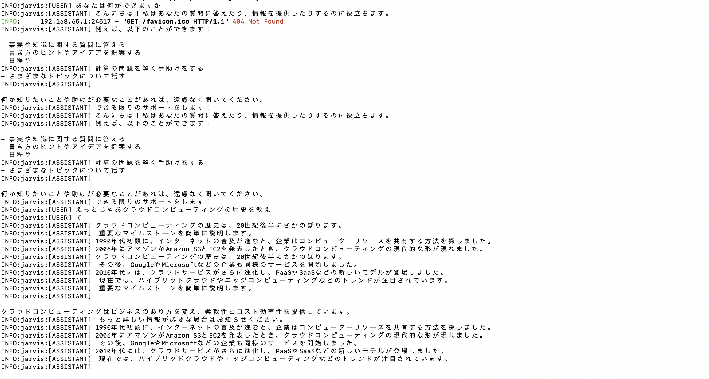

*修正前。同じ段落が2回ずつ並び、断片の順序も入れ替わっている。*

当初は `stopReason` で判別しようとしたが、想定した値と異なり効かなかった。
最終的に**直近12件のテキストを保持し、同一内容が来たら捨てる**方式にした。
値の仕様に依存しないぶん、こちらのほうが壊れにくい。

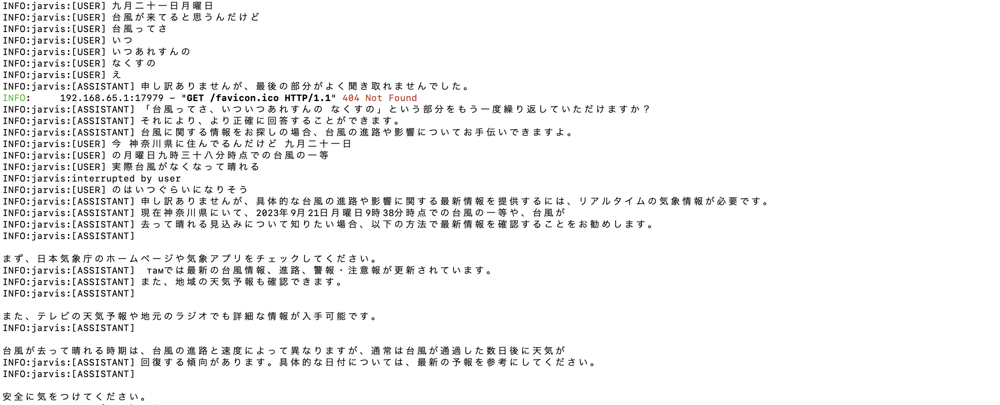

*修正後。重複が消え、`interrupted by user` が会話とは別に記録されている。割り込み直後も会話が継続している。*

### 割り込みが専用イベントではなく textOutput で届く

ユーザーが発話に被せると `{"interrupted": true}` という JSON が
`textOutput` の content として送られてくる。
中身を見て振り分けないと、会話ログに JSON がそのまま並ぶ。

さらに、割り込みを検知したらブラウザ側で**再生予約済みの音声を破棄する**必要がある。
これをしないと、遮ったはずの発言が最後まで再生され続ける。

### terraform plan は IAM 権限不足を検出しない

plan が参照するのは `sts:GetCallerIdentity` のみで、
実際の作成権限は apply まで検証されない。

結果として、S3 の4リソースだけ作成された状態で
DynamoDB / ECR / IAM が `AccessDenied` で停止した。

ただし**state には成功分が記録されているため、権限を付与して apply を再実行すれば続きから作られる**。
作り直しは不要だった。

### backend 移行は2段階

tfstate を置く S3 バケット自体を Terraform で作るため、初回はローカル state で apply し、
バケット作成後に `backend` ブロックを有効化して `terraform init -migrate-state` で移行する。

`backend` ブロックがコメントアウトされたままだと `-migrate-state` は何も聞いてこず、
移行されないまま成功したように見えるので注意。

### プロバイダキャッシュの破損

`terraform apply` の実行中に中断すると、
`.terraform/providers` のチェックサム検証が落ちて以降のコマンドが全滅する。

```bash
rm -rf .terraform && terraform init
```

state は S3 にあるため、この操作でリソースが失われることはない。

### ECR のイメージ削除

`terraform destroy` はイメージが残っているとリポジトリを削除できない。
タグなしのマニフェストも残るため、`--force` が必要。

```bash
aws ecr delete-repository --repository-name jarvis --force
```

---

## 現時点の制約

**日本語は公式には未対応。**
AWS のドキュメント上、Nova 2 Sonic の対応言語は英語・仏語・伊語・独語・西語の5言語で、
日本語は含まれていない。ただし実際に試したところ、日本語での発話認識と応答の両方が動作した。
文字起こしの精度は短い発話や固有名詞で落ちる傾向がある。

**使える外部情報は日時と天気のみ。**
カレンダーなど、認証が必要な外部サービスとの連携はまだない。

---

## 今後

- **Sprint 2** — 完了。日時・天気ツールを追加（カレンダー参照と TLS 対応は未着手）
- **Sprint 3** — 会話状態の DynamoDB 永続化、スティッキーセッションの解消
- **Sprint 4** — Cognito 認証、GitHub Actions による CI/CD
